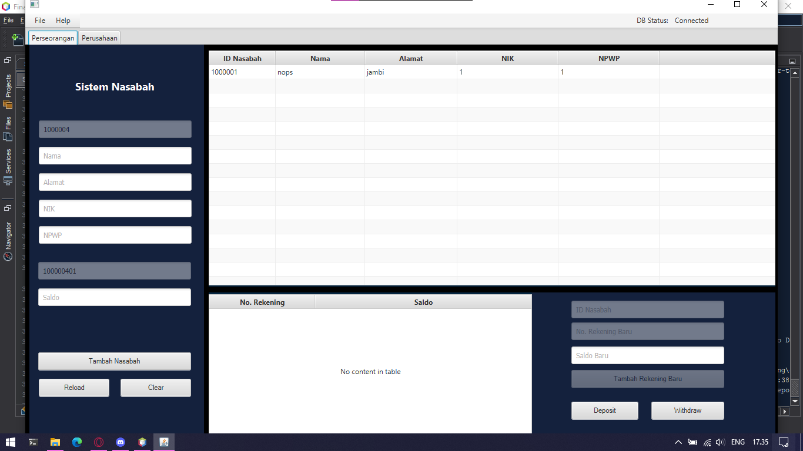

# final-project
Nama Anggota:
1. Fachri Azka Nur      (2017051054) - implementasi uml dan membuat class yang dibutuhkan
2. Naufal Anbial Falah  (2017051072) - menghubungkan dengan database dan desain javaFX
3. Rizqy Farhan Thoriq  (0620101078) - update class agar kompatibel dengan javaFX

ER Diagram
erDiagram
          Nasabah ||..|| Individu : is
          Nasabah ||--|| Perusahaan : is
          Nasabah ||--|{ Rekening: "has"
          Nasabah {
            int idNasabah
            string nama
            string alamat
          }
          Individu{
            string nik
            string npwp
          }
          Perusahaan{
            string nib
          }
          Rekening{
            int noRekening
            double saldo
          }

Program sistem nasabah yang digunakan untuk menambahkan data nasabah individu maupun perusahaan.

